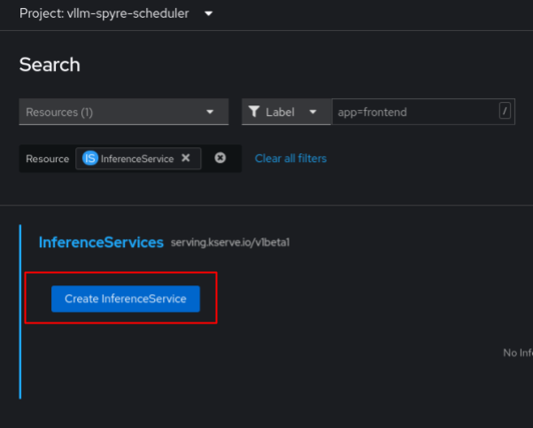

# 5. Create Inference Service

These instructions are for `cluster-admin` and ldap users who are using RHOAI to create an Inference Service.

*Confirm you are in the vllm-spyre-scheduler Project/Namespace*

---

## Search for the InferenceService Resource

Under Home > Search > *Type in InferenceService*
---


---

### Click Create InferenceService



---

#### Copy and Paste this YAML.

```
apiVersion: serving.kserve.io/v1beta1
kind: InferenceService
metadata:
  annotations:
    openshift.io/display-name: granite-3-1-8b-instruct
    serving.kserve.io/deploymentMode: RawDeployment
  name: granite-3-1-8b-instruct
  labels:
    networking.kserve.io/visibility: exposed
    opendatahub.io/dashboard: 'true'
spec:
  predictor:
    imagePullSecrets:
      - name: vllm-registry
    maxReplicas: 1
    minReplicas: 1
    model:
      modelFormat:
        name: vLLM
      name: ''
      resources:
        limits:
          ibm.com/spyre_pf: '1'
        requests:
          ibm.com/spyre_pf: '1'
      runtime: vllm-spyre-runtime
      storageUri: 'oci://registry.redhat.io/rhelai1/modelcar-granite-3-1-8b-instruct:1.5'
    schedulerName: spyre-scheduler
    tolerations:
      - effect: NoSchedule
        key: ibm.com/spyre_pf
        operator: Exists
```
And press Create again at the bottom of the page to deploy the InferenceService connected to our granite model!

---


Wait for the Ready Condition at the bottom of the page to be True
-----
  
Connecting to our model and deploying the Kserve Container can take 5-10 minutes.


---

<p align="center">
  <a href="/docs/04-add-registry-pull-secret.md">Previous</a>
  <a href="/docs/06-validated-models.md">Next</a>
</p>
