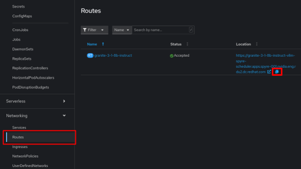
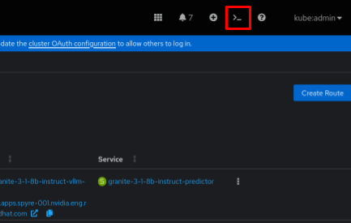

# 6. Model Inference


### Retrieve our InferenceService Endpoint

Under Networking > Routes > *Copy the URL*
---




#### At this point you could place the url inside of an application or api gateway. 

#### For now, let's test it by using just a curl command in our terminal.

---

### Open up the Web Terminal inside of OpenShift


---


---

Test our InferenceService and Model!
-----

#### [IMPORTANT] Comfirm that your new route matches the one below. If not, replace the route with your own.

#### Copy and Paste this command into the terminal, feel free to change the prompt, and then run it.

```
curl -k "https://granite-3-1-8b-instruct-vllm-spyre-scheduler.apps.spyre-001.nvidia.eng.rdu2.dc.redhat.com/v1/completions" \
  -H "Content-Type: application/json" \
  -d '{"model":"granite-3-1-8b-instruct","prompt":"Write a short horoscope for today's date.","temperature":0,"max_tokens":128}' \
| jq
```

Now we know we have a working LLM! As simple as that!

---

<p align="center">
  <a href="/docs/05-create-inference-service.md">Previous</a>
</p>
